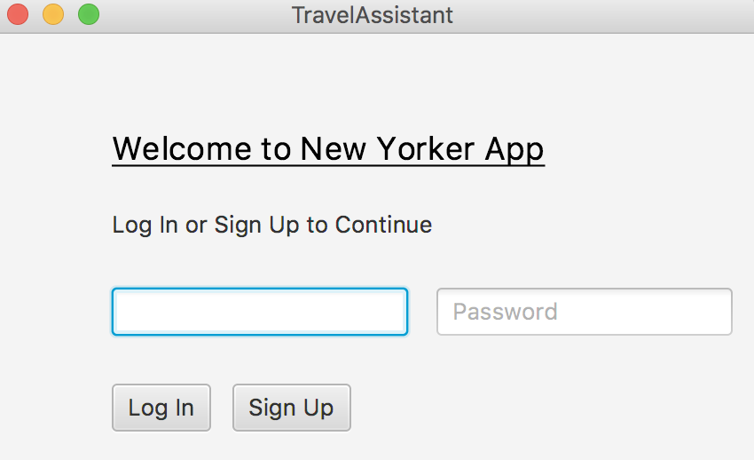
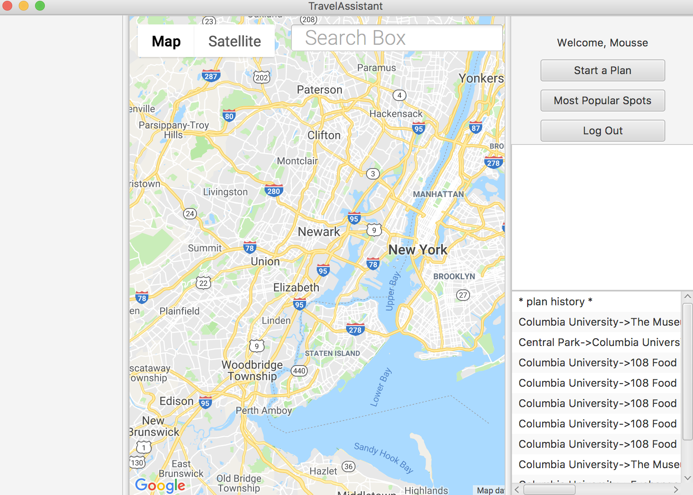

This project is co-developed by Xijie Guo, Yun Wang, Jerry Lin, Haoran Geng

# Travel-Assistant

Have you ever found yourself in a new city, having a couple places in mind to visit, but not knowing where to go first? Do you find trip planning sometimes cumbersome and tiring? Not anymore! New Yorker is a trip planning application that can help you instantly plan your day trip based on your preferences!

### To install the application, simply follow the five steps below:
1. Install Ant on your machine
2. Clone this repository to your machine
3. Unzip it and navigate to the project root directory
4. Run `sh ./scripts/rm-build.sh && ant compile` in command line
5. Enjoy!

### To run the application, follow the below two steps:
1. Navigate to the project root directory
2. Run `sh run.sh` in command line
* Or just run Main class in IDE

### To test the application and generate unit test and coverage test reports:
1. Navigate to the project root directory
2. Run `ant test && ant report` in command line

### To use the application, follow the following instructions:
There are two UIs, login UI and Main UI, as shown in picture below.

                                                Login UI
                            

                                                Main UI

#### Step 1: 
First in Login UI, sign up if you don't have an account yet.
Rules for username and password:
1. The usernmae cannot contain any space.
2. The password can contain some spaces but cannot be all blank.
3. Both the username and the password cannot be all empty.
4. Cannot sign up with a username that is already taken.
*Note: 1, 2, 3 are considered as invalid username or password situation. 4 is considered as username taken situation. Corresponding messages will be displayed on UI.

#### Step 2: 
If you have an account already, simply sign in.

#### Step3:
If you successfully signed in, you can see the main UI. There are three options.
Click on the "Start a Plan" button to start using the application.
Click on the "Most popular spots" button to see the mostly visited spots by other users.
Click on the "Log Out" button to log out. You will then return to the Login UI.

#### Step 4: 
Enter the location that you want to visit in the search bar and hit enter key to search the location on Google Maps(You can still search locations if you do not click on "Start a plan" button but cannot move on to generate travel plans).
Click on the "Add Location" button to add the spot to the spot list.
Select one spot and click on the "Delete" button to delete it. 
*Note: 
1. You must re-enter the location and hit the enter key before adding it to the spot list.
2. You cannot delete anything if you don't select any spot.

#### Step 5:
Choose either "Time" or "Distance" as the calculation metric. The default metric is "Time".
Choose either "Walking", "Driving", "Bicycling", or "Transiting" as the traffic mode. The default traffic mode is "Walking".

#### Step 6:
Click on "Generate Trip Plan" to order the spots in a correct visiting order in terms of shortest path based on the corresponding calculation metrics and traffic mode. The first spot is always the starting point and the ending point.

#### Step 7:
Click on "Save" button if you want to save this travel plan into the database and the plan history section on Main UI will be updated to display the travel plan you just saved. 

### Basic Tech Stack
MongoDB, JavaFX, Google Maps API, OKHttp Lib

